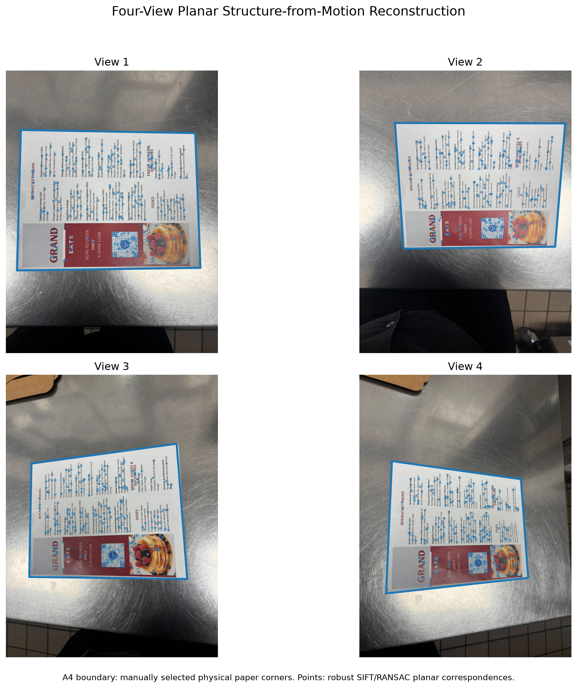
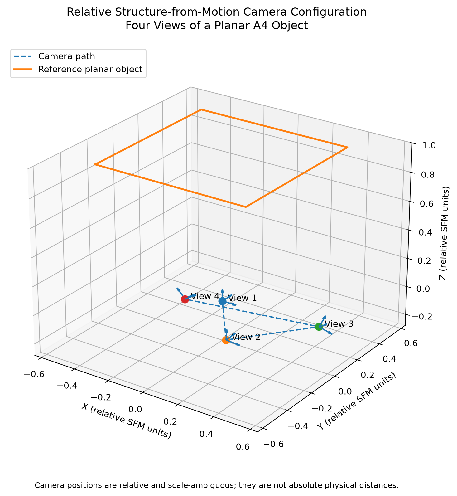
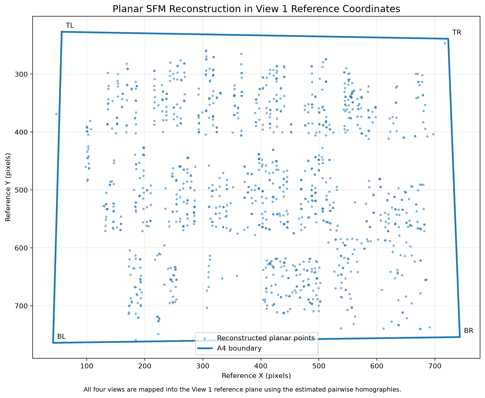

# CSc 8830 – Assignment 6
## Optical Flow and Structure from Motion

**Student:** Olumide Adebisi  
**Course:** CSc 8830 – Computer Vision  
**Semester:** Fall 2026

---

## Project Overview

This project contains the implementation for Assignment 6 in CSc 8830.

The assignment has two main parts:

1. Optical flow and motion tracking using two video samples.
2. Structure from Motion (SFM) using four views of a planar object.

The project is implemented in Python using OpenCV and NumPy, with Matplotlib used for selected visualizations.

The source code, experimental results, mathematical work, and visual evidence are organized in this repository.

---

# Part A – Optical Flow and Motion Tracking

Two videos were selected for the optical-flow experiment:

| Video | Selected sample |
|---|---|
| People walking | 30 seconds |
| Cars in traffic | 30 seconds |

Dense optical flow was calculated using the Farneback method.

## Optical Flow Results

| Video | Mean flow magnitude | Maximum flow magnitude |
|---|---:|---:|
| People walking | 2.2337 px | 181.6555 px |
| Cars in traffic | 0.3255 px | 24.3862 px |

The people-walking sequence produced larger flow values because there is more visible motion from people and other moving objects. The traffic sequence had smaller average motion in the selected sample.

## Motion Tracking Validation

For each video, two consecutive frames were used to compare optical-flow predictions with feature tracking results.

Lucas-Kanade tracking was used to obtain the tracked feature locations. The dense Farneback flow field was then used to predict the next location of each feature using bilinear interpolation.

A tracking error of 1 pixel or less was treated as an inlier for the validation.

| Video | Points tracked | Inliers | Inlier rate | Robust mean error |
|---|---:|---:|---:|---:|
| People walking | 20/20 | 14/20 | 70% | 0.1793 px |
| Cars in traffic | 20/20 | 20/20 | 100% | 0.0480 px |

The people-walking sequence contains several larger tracking errors because some features are associated with independently moving objects. The median and inlier results provide a better description of the normal tracking performance than the maximum error alone.

## Bilinear Interpolation

A subpixel point was used to demonstrate bilinear interpolation of the dense flow field.

Starting location:

\[
(x,y)=(695.35,\ 354.62)
\]

The interpolated flow was:

\[
u=0.522021
\]

\[
v=1.264873
\]

The predicted location in the next frame was therefore:

\[
x'=695.872021
\]

\[
y'=355.884873
\]

The derivation and numerical calculation are included in:

```text
report/mathematical_workout.md
```

---

# Part B – Structure from Motion

The SFM experiment uses four photographs of the same A4 planar object taken from different viewpoints.

The four input images are:

```text
data/sfm/view1.jpeg
data/sfm/view2.jpeg
data/sfm/view3.jpeg
data/sfm/view4.jpeg
```

A previously calibrated camera was used for the reconstruction.

## Camera Calibration

The camera matrix used in the experiment was:

\[
K=
\begin{bmatrix}
797.626 & 0 & 386.727\\
0 & 797.129 & 535.011\\
0 & 0 & 1
\end{bmatrix}
\]

Image size:

\[
810 \times 1080
\]

Mean calibration reprojection error:

\[
0.6274\text{ px}
\]

## Homography Results

SIFT features were matched between consecutive views and RANSAC was used to estimate the planar homographies.

| View transition | Good matches | Inliers | Inlier rate | Mean reprojection error |
|---|---:|---:|---:|---:|
| View 1 → View 2 | 1,268 | 1,107 | 87.30% | 0.536 px |
| View 2 → View 3 | 1,136 | 995 | 87.59% | 0.910 px |
| View 3 → View 4 | 984 | 870 | 88.41% | 0.873 px |

The high inlier percentages and sub-pixel reprojection errors indicate that the matched features provide a strong planar correspondence between the views.

## Homography Decomposition

Each calibrated homography was decomposed into possible camera-motion solutions.

The physically consistent solution was selected using positive-depth testing.

| View transition | Selected solution | Positive-depth fraction |
|---|---:|---:|
| View 1 → View 2 | 1 | 100% |
| View 2 → View 3 | 4 | 100% |
| View 3 → View 4 | 1 | 100% |

## Relative Camera Positions

The reconstructed camera centers are expressed in relative SFM units.

| View | X | Y | Z |
|---|---:|---:|---:|
| View 1 | 0.0000 | 0.0000 | 0.0000 |
| View 2 | 0.0131 | 0.0115 | -0.2807 |
| View 3 | 0.4018 | 0.2314 | -0.1566 |
| View 4 | -0.3993 | 0.2451 | -0.2694 |

These values describe the relative camera configuration. They are not reported as millimeters because the translation scale in monocular planar SFM is arbitrary.

---

# SFM Visual Results

## Four-View Reconstruction



The blue boundary follows the physical A4 sheet in each of the four views. The plotted feature points represent the image features used in the planar reconstruction.

## Relative Camera Configuration



This figure shows the four reconstructed camera positions and their relative orientations.

## Planar Reconstruction



The feature points from the four views are mapped into the View 1 reference coordinate system using the estimated pairwise homographies.

---

# Project Structure

```text
CSC8830_Module6_OpticalFlow_SfM/
│
├── app/
│
├── data/
│   ├── videos/
│   └── sfm/
│
├── outputs/
│   ├── optical_flow/
│   ├── tracking/
│   └── sfm/
│
├── report/
│   └── mathematical_workout.md
│
├── src/
│   ├── extract_video_samples.py
│   ├── optical_flow.py
│   ├── tracking_validation.py
│   ├── bilinear_interpolation_demo.py
│   ├── sfm_reconstruction.py
│   ├── sfm_pose_reconstruction.py
│   ├── relative_sfm_reconstruction.py
│   ├── visualize_sfm_cameras.py
│   └── sfm_four_view_visualization.py
│
├── tests/
│
├── README.md
├── requirements.txt
└── STEP_BY_STEP.md
```

---

# Main Scripts

### `extract_video_samples.py`

Extracts the selected 30-second portions of the two videos and saves representative frames and metadata.

### `optical_flow.py`

Computes dense Farneback optical flow and generates optical-flow visualizations.

### `tracking_validation.py`

Tracks feature points between consecutive frames and compares Lucas-Kanade tracking with the dense optical-flow prediction.

### `bilinear_interpolation_demo.py`

Demonstrates bilinear interpolation of the optical-flow vector at a subpixel location.

### `sfm_reconstruction.py`

Performs SIFT feature detection, feature matching, homography estimation, and planar point reconstruction.

### `relative_sfm_reconstruction.py`

Decomposes the calibrated homographies and selects physically consistent camera-motion solutions using positive-depth testing.

### `visualize_sfm_cameras.py`

Creates the 3D relative camera configuration.

### `sfm_four_view_visualization.py`

Creates the four-view reconstruction and the planar SFM visualization.

---

# Reproducing the Results

Create and activate a Python virtual environment and install the required packages:

```powershell
python -m pip install -r requirements.txt
```

Run the processing scripts from the project root:

```powershell
python ".\src\extract_video_samples.py"
python ".\src\optical_flow.py"
python ".\src\tracking_validation.py"
python ".\src\bilinear_interpolation_demo.py"
python ".\src\relative_sfm_reconstruction.py"
python ".\src\visualize_sfm_cameras.py"
python ".\src\sfm_four_view_visualization.py"
```

Generated results are saved under:

```text
outputs/
```

---

# Notes on the SFM Reconstruction

The SFM experiment uses a flat planar object, so the reconstruction is treated as a planar monocular SFM problem.

The camera positions are therefore reported in relative SFM units rather than absolute physical units.

The project also includes the camera calibration file used for the reconstruction and the manually selected A4 boundary points used to validate the planar object.

---

# Assignment Evidence

This repository contains the main implementation and evidence for the assignment:

- Optical-flow processing
- Optical-flow visualizations
- Motion-tracking validation
- Bilinear interpolation
- Mathematical calculations
- Four-view planar SFM
- Camera calibration
- Feature matching
- Homography estimation
- Homography decomposition
- Positive-depth validation
- Relative camera positions
- SFM visualization figures

The final report and screen recording are submitted separately with the assignment.
